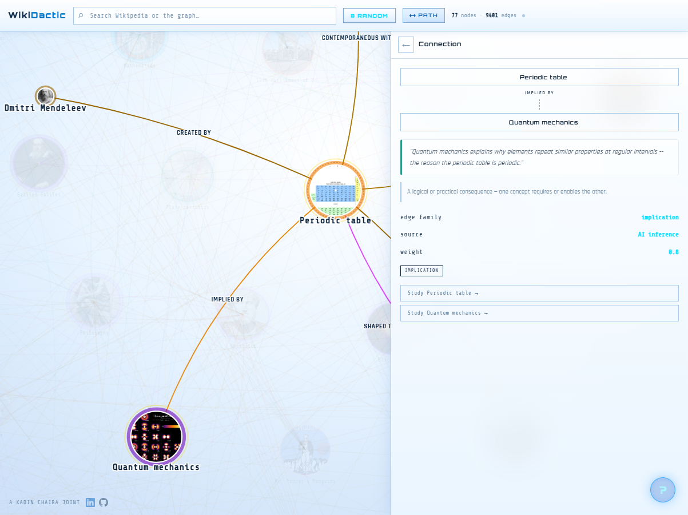
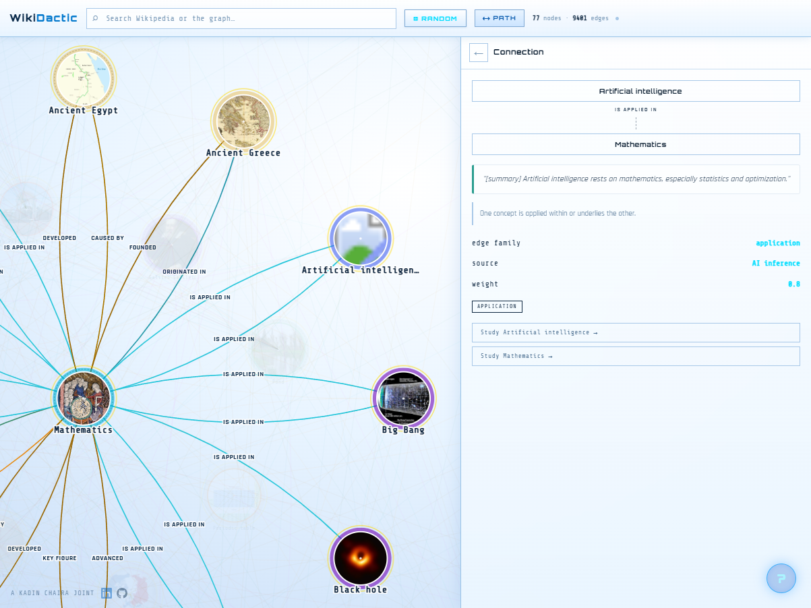
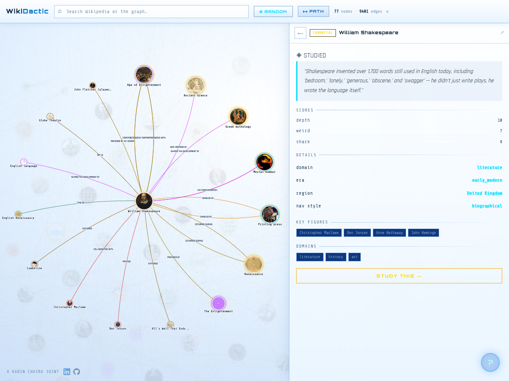
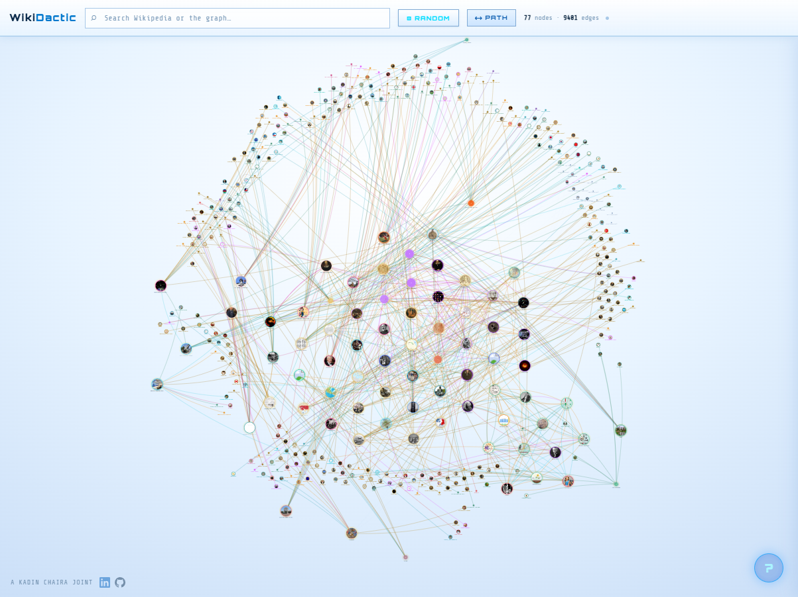
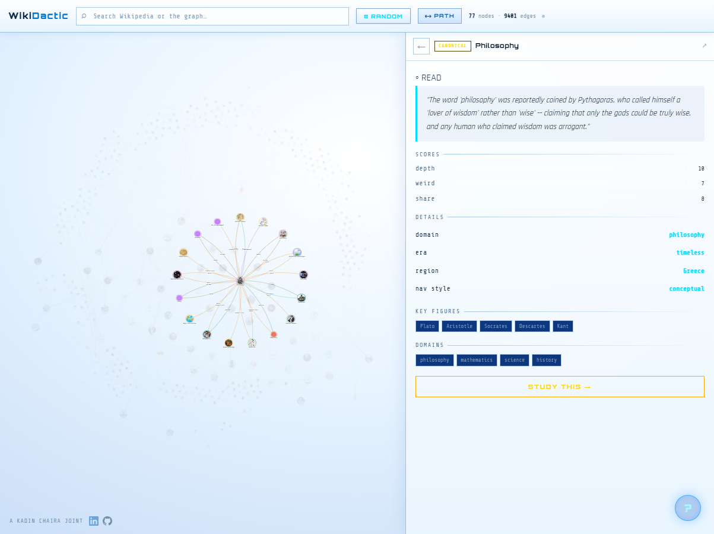

# WikiPlex

WikiPlex grew out of [WikiDactic](https://wikidactic.com), a project that turns Wikipedia articles into structured learning courses. WikiPlex takes it further by turning all of Wikipedia into a living, explorable knowledge graph. You start from any article, and the system classifies it, maps its relationships to other topics, and generates study material on the spot. The result is a visual web of human knowledge that you can click through, study from, and keep building.

The classification pipeline fetches articles from Wikipedia, sends them through an AI classifier, and writes structured nodes, typed edges, and curriculum data into a graph that the frontend renders with D3. Relationships aren't just hyperlinks. The classifier infers how topics actually relate to each other: who influenced whom, what caused what, where something originated, what implies what. Each edge gets a type and a plain-language explanation.

## Screenshots

### Connection detail
Click any edge between two nodes to see the relationship type, a natural-language explanation of the connection, and its source. Here, the Periodic Table is linked to Quantum Mechanics through an implication relationship.



### Domain clusters
Topics cluster by academic domain. Mathematics fans out to Artificial Intelligence, Big Bang, Black Hole, and more through "is applied in" edges. Colors correspond to domains, so you can see the shape of knowledge at a glance.



### Node detail
Selecting a node shows its classification metadata: depth, weirdness, and shareability scores, its domain and era, key figures, and a curiosity hook. Progress states track what you've read, studied, and conquered.



### Full graph
The full knowledge graph zoomed out. Every node is a classified Wikipedia article with a thumbnail image, colored by domain, sized by connectivity. The edges form a dense but navigable web across science, history, literature, and everything in between.



### Study mode
Hit "Study This" on any node and the system generates a curriculum with an overview, key terms, knowledge gaps not covered by the Wikipedia article itself, flashcards, and a tiered quiz. The graph stays visible on the left so you can keep exploring while you learn.



## Setup

```bash
pip install -r requirements.txt
cp .env.example .env
# add your ANTHROPIC_API_KEY to .env
```

## Usage

```bash
python pipeline.py "French Revolution"   # classify a specific article
python pipeline.py --random              # start from a random article
python pipeline.py                       # interactive prompt
```

## How it works

1. Fetches article text and outbound links from Wikipedia
2. Filters out stubs, list pages, and disambiguation pages
3. Sends the article to the Claude API for classification
4. Parses the response into nodes, typed edges, and curriculum data
5. Saves curriculum details to `curricula/<title>.json`
6. Updates the graph with the new node, edges, and frontier

## Graph structure

Nodes are keyed by exact Wikipedia title. Edges are either structural (raw Wikipedia links) or typed relationships inferred by the classifier: interpersonal, geographical, temporal, categorical, etymological, positional, implication, analogy, influence, and more. Unvisited link targets live in a frontier queue for future classification.

## Viewing the graph

The full interactive graph runs at [wikidactic.com](https://wikidactic.com). For local development, open `viewer.html` in a browser:

```bash
python -m http.server
# then visit http://localhost:8000/viewer.html
```

## Project layout

```
pipeline.py         classification pipeline
server.js           Express API server
app.js              frontend application
index.html          main interface
style.css           styles
viewer.html         standalone D3 graph viewer
migrate_to_pg.py    JSON to PostgreSQL migration
deploy.sh           production deployment script
graph.json          the knowledge graph (gitignored while building)
curricula/          per-article curriculum files (gitignored)
.env                API keys (gitignored)
```

## Notes

- Node IDs are exact Wikipedia article titles, spaces preserved
- Timestamps are UTC ISO 8601
- Edge deduplication key is (from, to, type)
- Do not edit graph.json while the pipeline is running
