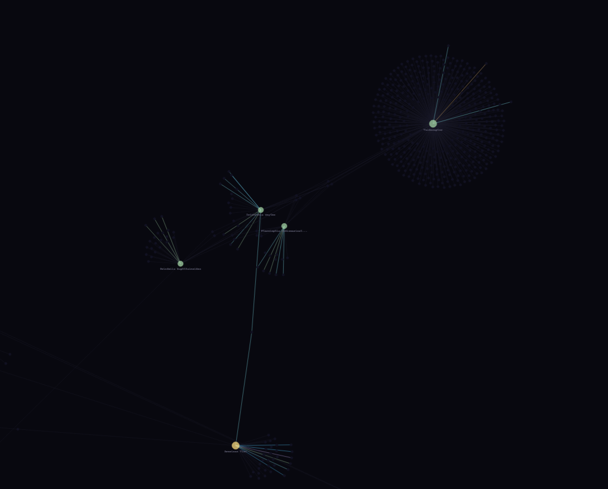
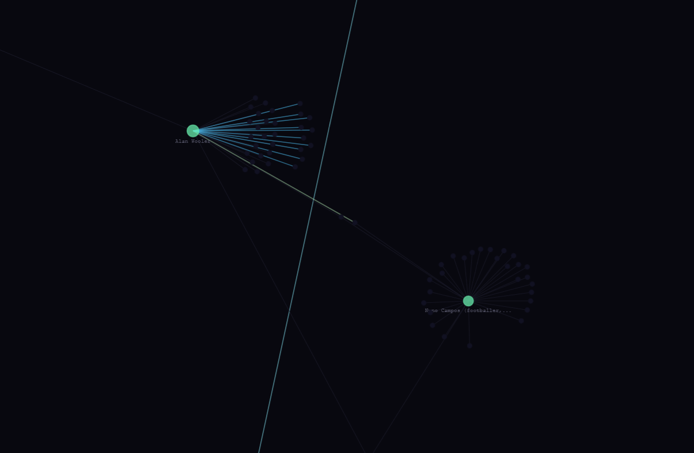
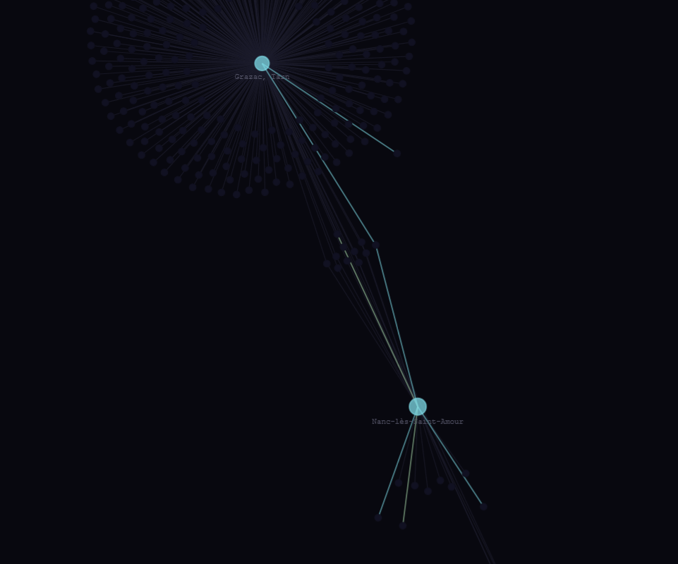

# WikiPlex

WikiPlex is the next evolution of [WikiDactic](https://WikiDactic.com). WikiDactic turns Wikipedia articles into structured learning courses. WikiPlex takes that further by turning all of Wikipedia into a multiplayer knowledge game.

Each player starts from a random article and builds a personal knowledge map by following links. Together, all players build a living topological graph of human curiosity.

This repo is the local classification pipeline - the data engine that powers the map. It fetches Wikipedia articles, classifies them with an AI API, and writes results to `graph.json`.

## Screenshots





## Setup

```bash
pip install -r requirements.txt
cp .env.example .env
# add your Anthropic API key to .env
```

## Usage

```bash
python pipeline.py "French Revolution"   # classify a specific article
python pipeline.py --random              # start from a random article
python pipeline.py                       # interactive prompt
```

## What it does

1. Fetches article text and outbound links from Wikipedia
2. Skips stubs, list pages, and disambiguation pages
3. Sends the article to the classification API
4. Parses the response into nodes, edges, and curriculum data
5. Saves curriculum details to `curricula/<title>.json`
6. Updates `graph.json` with the new node, edges, and frontier

## graph.json structure

Nodes are keyed by exact Wikipedia title. Edges are either `structural` (raw Wikipedia links) or typed relationships inferred by the classifier (`interpersonal`, `geographical`, `temporal`, `categorical`, `etymological`, `positional`). Unvisited link targets live in `frontier`.

## Viewing the graph

Open `viewer.html` in a browser. Serve locally if your browser blocks local file fetches:

```bash
python -m http.server
```

Then go to `http://localhost:8000/viewer.html`.

## Project layout

```
pipeline.py       main script
graph.json        the knowledge graph (gitignored while building)
curricula/        per-article curriculum files (gitignored)
viewer.html       D3 force graph viewer
requirements.txt
.env              API keys (gitignored)
```

## Notes

- Node IDs are exact Wikipedia article titles, spaces preserved
- Timestamps are UTC ISO 8601
- Edge deduplication key is (from, to, type)
- Do not edit graph.json while the pipeline is running
